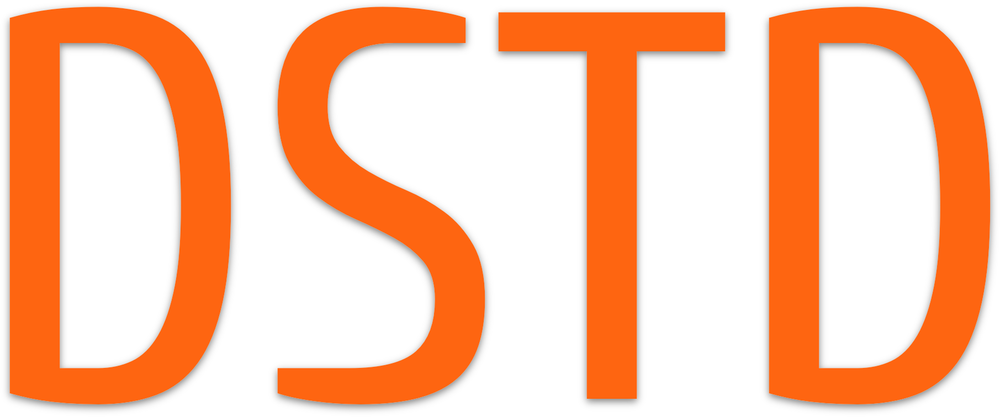

<p align="center">
    
</p>

Welcome to **DSTD**, [my](https://github.com/TwoDollarsEsq) attempt to bring some declarativity to C++ programming language without losing too much speed. You are invited to participate in the development process of ~~making Swift from C++~~ making C++ code more declarative.

# ❤️ DCollection.hpp
The heart of the project. You need to include this file somewhere in your programm to get started. The file provides new types for you via extending STL containers.

So, you can do something like this:

```C++
bool lessThanFive(int integer) {
    return integer < 5;
}

...

yourDCollectionOfInts.filter(lessThanFive);
```

And with the power of lambdas it becomes something like this:

```C++
yourDCollectionOfInts.filter([](int integer) -> bool {
    return integer < 5;
});
```
DCollection brings some cool stuff like **Lambda-operators** and **Macro-lambdas** to make your experience even better! Lambda-operators are just constant variables which stores generic lambdas for common operations, like arithmetic ones, and the macro-lambdas let you to write your logic inline.  

## Meet Your Collections
By far, there are DVector, DQueue, DList, DSet and DMap. All of them are stored in dstd namespace with coresponding names: vector, queue, list, set, map. <br>
Let's look at the example of using dstd::vector of some physics objects:

```C++
dstd::vector<Collidable> objects;
...
// In update loop we check if object is selected and, if not, run physics simulation for it.
objects.filter(LAr( !i0.isSelected ).forEach(LA( i0.simulatePhysics() ));
...
```
And another example. Now we got the list of statistic data and we want to get an average:

```C++
dstd::list<double> statistic;
...
double average = objects.reduce(0, ADD) / objects.size();
...
```

## Dependencies
All you need is love and C++14.
